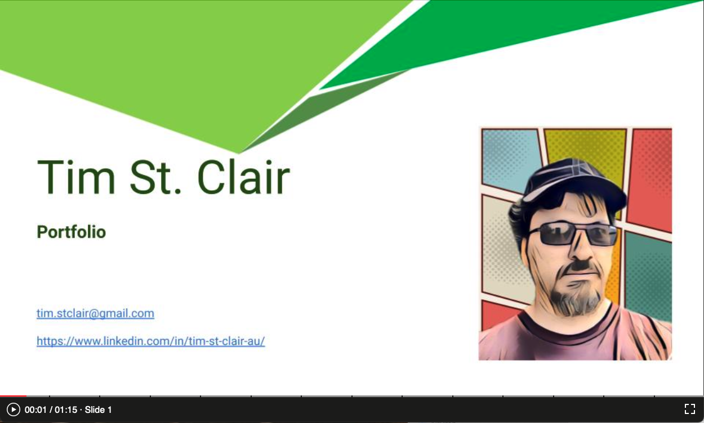

# slides.to-scorm.com
Source code to https://slides.to-scorm.com

This will convert **google slides, powerpoint, keynote** and **opendocument** slide formats to a series of JPG files.

It then lets you record audio or video from your webcam or microphone, or upload webm/mp4 video, or mp3 audio to each slide.

It creates a SCORM-compatible wrapper so that you can get a completion for watching the presentation.

## Playback

Slides automatically change based on the length of the audio or video you recorded for each slide. It uses a simple interface similar to YouTube's chapter markers.

There are no design options. The package/code produced is self contained and simple enough to follow. To run in a standalone environment, simply load 'index.html' in the package folder.

## Compatibility

Not really known. I built this in Chrome and Safari on macos 11 where it works. Your mileage may vary.

## Licence

MIT
